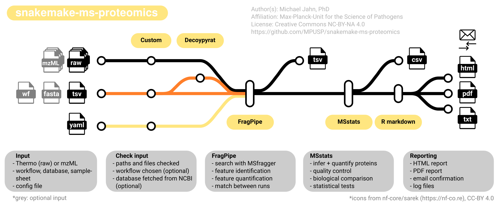

# snakemake-ms-proteomics

<!-- badges start -->
[](https://github.com/MPUSP)


[](https://docs.conda.io/en/latest/)
<!-- badges end -->


-------------------------------------------------

A pipeline for the automatic initial processing and quality control of mass spectrometry data.

- [snakemake-ms-proteomics](#snakemake-ms-proteomics)
  - [Pipeline overview](#pipeline-overview)
  - [Installation](#installation)
    - [Snakemake](#snakemake)
    - [Fragpipe](#fragpipe)
    - [Additional tools](#additional-tools)
  - [Running the pipeline](#running-the-pipeline)
    - [Input data](#input-data)
    - [Execution](#execution)
    - [Parameters](#parameters)
  - [Output](#output)
  - [Authors](#authors)
  - [References](#references)

## Pipeline overview

<!-- include logo-->


-------------------------------------------------

This pipeline is a best-practice pipeline for the automated analysis of mass spectrometry proteomics data. It currently supports automated analysis of data-dependent acquisition (DDA) data with label-free quantification. An extension by different wokflows (DIA, isotope labeling) is planned in the future. The pipeline is mainly a wrapper for the excellent tools [fragpipe](https://fragpipe.nesvilab.org/) and [MSstats](https://www.bioconductor.org/packages/release/bioc/html/MSstats.html), with additional modules that supply and check the required input files, and generate reports. The pipeline is built using [snakemake](https://snakemake.readthedocs.io/en/stable/) and processes MS data using the following steps:

1. Prepare `workflow` file (`python` script)
2. check user-supplied sample sheet (`python` script)
3. Fetch protein database from NCBI or use user-supplied fasta file (`python`, [NCBI Datasets](https://www.ncbi.nlm.nih.gov/datasets/docs/v2/))
4. Generate decoy proteins ([DecoyPyrat](https://github.com/wtsi-proteomics/DecoyPYrat))
5. Import raw files, search protein database ([fragpipe](https://fragpipe.nesvilab.org/))
6. Align feature maps using IonQuant ([fragpipe](https://fragpipe.nesvilab.org/))
7. Import quantified features, infer and quantify proteins ([R MSstats](https://www.bioconductor.org/packages/release/bioc/html/MSstats.html))
8. Compare different biological conditions, export results ([R MSstats](https://www.bioconductor.org/packages/release/bioc/html/MSstats.html))
9. Generate HTML report with embedded QC plots ([R markdown](https://rmarkdown.rstudio.com/))
10. Generate PDF report from HTML [weasyprint](https://weasyprint.org/)
11. Send out report by email (`python` script)
12. Clean up temporary files after pipeline execution (`bash` script)

If you want to contribute, report issues, or suggest features, please get in touch on [github](https://github.com/MPUSP/snakemake-ms-proteomics).

## Installation

### Snakemake

Step 1: Install snakemake with `conda`, `mamba`, `micromamba` (or any another `conda` flavor). This step generates a new conda environment called `snakemake-ms-proteomics`, which will be used for all further installations.

```
conda create -c conda-forge -c bioconda -n snakemake-ms-proteomics snakemake
```

Step 2: Activate conda environment with snakemake

```
source /path/to/conda/bin/activate
conda activate snakemake-ms-proteomics
```

Alternatively, install `snakemake` using pip:

```
pip install snakemake
```

Or install `snakemake` globally from linux archives:

```
sudo apt install snakemake
```

### Fragpipe

Fragpipe is not available on `conda` or other package archives. It needs to installed as a standalone, executable package.

Step 1: Download the latest [fragpipe release from github](https://github.com/Nesvilab/FragPipe/releases)

- download to desired destination
- unzip archive
- on linux, test fragpipe by running in terminal:

```
cd fragpipe/bin
./fragpipe
```

This will start the GUI (graphical user interface). To finish the installation, continue with the following steps.

Step 2: Configure Fragpipe

- in the `Config` tab, download/update the required modules (MSFragger, IonQuant, Philosopher, EasyPQP)
- some of these require the user to approve the academic license agreement
- if automatic download from GUI fails, install e.g. `philospopher` manually
- download `philospopher` `*.deb` package from [github](https://github.com/Nesvilab/philosopher/releases/) and run:

```
sudo dpkg -i path/to/*.deb
```

### Additional tools

**Important note:**

All other dependencies for the pipeline are **automatically pulled as `conda` environments** by snakemake, when running the pipeline with the `--use-conda` parameter (recommended).

In case the pipeline should be executed **without `conda`**, the following packages need to be installed.


Step 1: In order to work with **Thermo `*.raw`** files, `mono` needs to be installed.

```
sudo apt install mono-devel
```

Step 2: Set up python packages.

Set the `python` environment in the Fragpipe `config` tab to your installed python version in order to fulfill all dependencies. If the Fragpipe GUI `config` tab shows complaints about missing python packages, install these packages into the specified `python` environment (`pandas`, `numpy`, `cython`):

```
conda install -c conda-forge <pandas/numpy/cython>
```

Step 3: Install [DecoyPyrat](https://github.com/wtsi-proteomics/DecoyPYrat) from `bioconda`.
This small tool can be used to generate superior decoy proteins from proteome `*.fasta` files.

```
conda install -c bioconda decoypyrat
```

Step 4: Install NCBI datasets command line tool from `conda-forge`.

```
conda install -c conda-forge ncbi-datasets-cli
```

Step 5: Install `Weasyprint` to convert HTML reports to PDF.

```
conda install -c conda-forge weasyprint
```

Step 6: Install a fresh **R environment** with a set of custom packages instead of the default system-wide one.

```
conda install -c conda-forge r-essentials
```

Then open an R session and install packages from within R like this:

```
# CRAN packages
install.packages(c("tidyverse", "ggrepel", "scales", "dendextend", "ggpubr", "BiocManager"))

# Bioconductor packages
BiocManager::install("MSstats")
```

## Running the pipeline

### Input data

The pipeline requires the following input files:

1. mass spectrometry data, such as Thermo `*.raw` or `*.mzML` files
2. an (organism) database in `*.fasta` format _OR_ a NCBI Refseq ID. Decoys (`rev_` prefix) will be added if necessary
3. a sample sheet in tab-separated format (aka `manifest` file)
4. a `workflow` file, the pipeline definition for fragpipe


The samplesheet file has the following structure with four mandatory columns and no header (example file: `test/input/samplesheet/samplesheet.tsv`). 

- `sample`: names/paths to raw files
- `condition`: experimental group, treatments
- `replicate`: replicate number, consecutively numbered. Repeating numbers (e.g. 1,2,1,2) will be treated as paired samples!
- `type`: the type of MS data, will be used to determine the workflow
- `control`: reference condition for testing differential abudandance

| sample   | condition   | replicate | type | control     |
| -------- | ----------- | --------- | ---- | ----------- |
| sample_1 | condition_1 | 1         | DDA  | condition_1 |
| sample_2 | condition_1 | 2         | DDA  | condition_1 |
| sample_3 | condition_2 | 3         | DDA  | condition_1 |
| sample_4 | condition_2 | 4         | DDA  | condition_1 |


For manual execution of the pipeline in fragpipe GUI, open the desired `manifest` and `workflow` files and set the correct paths to input files, database, and the python environment (see `Installation --> Fragpipe`).

### Execution

To run the pipeline from command line, change the working directory.

```
cd /path/to/snakemake-ms-proteomics
```

The top level folder `snakemake-ms-proteomics` contains the `snakefile`, which defines the snakemake rules that detail the different rules for execution of the pipeline.

By default, `snakemake` treats the _first_ rule as the target rule if not another rule is passed as command line argument. Therefore, the first rule defines the desired output files.

A config file, `config.yml`, is passed to snakemake which contains global or module-specific options. The global options are the paths to the input files (samplesheet, workflow, `*.fasta` database), and the output folder. For the test data included in this repository they should work out of the box on linux systems (Note that raw files are currently missing). The only option that needs to be adjusted manually is the location of the `fragpipe` binary (`module options` --> `fragpipe` --> `path`).

Before running the entire pipeline, we can perform a dry run using:

```
snakemake --configfile 'config/config.yml' --dry-run
```

To run the complete pipeline with test files, execute the following command. The definition of the number of compute cores is mandatory.

```
snakemake --configfile 'config/config.yml' --cores 10 --use-conda
```

To supply options that override the defaults, run the pipeline like this:

```
snakemake --cores 10 --use-conda \
  --configfile 'config/config.yml' \
  --config \
  samplesheet='test/input/config/samplesheet.fp-manifest' \
  database='test/input/database/database.fasta' \
  workflow='workflows/LFQ-MBR.workflow' \
  output='test/output/'
```

### Parameters

This table lists all **mandatory parameters** to the pipeline (data and executable paths).

| parameter   | type                   | details             | example                                                 |
| ----------- | ---------------------- | ------------------- | ------------------------------------------------------- |
| samplesheet | `*.tsv`                | tab-separated file  | `test/input/config/samplesheet.tsv`                     |
| database    | `*.fasta` OR refseq ID | plain text          | `test/input/database/database.fasta`, `GCF_000009045.1` |
| workflow    | `*.workflow` OR string | a fragpipe workflow | `workflows/LFQ-MBR.workflow`, `from_samplesheet`        |
| output      | path                   | valid directory     | `test/output/`                                          |

This table lists all **module-specific, optional parameters** and their default values, as included in the `config.yml` file.

| module     | parameter        | default                            | details                                                          |
| ---------- | ---------------- | ---------------------------------- | ---------------------------------------------------------------- |
| decoypyrat | `cleavage_sites` | `KR`                               | amino acids residues used for decoy peptide generation           |
|            | `decoy_prefix`   | `rev`                              | decoy prefix appended to proteins names                          |
| fragpipe   | `path`           | `path/to/fragpipe/bin`             | path to fragpipe executable                                      |
| msstats    | `logTrans`       | `2`                                | base for log fold change transformation                          |
|            | `normalization`  | `equalizeMedians`                  | normalization strategy for feature intensity, see MSstats manual |
|            | `featureSubset`  | `all`                              | which features to use for quantification                         |
|            | `summaryMethod`  | `TMP`                              | how to calculate protein from feature intensity                  |
|            | `MBimpute`       | `True`                             | Imputes missing values with Accelerated failure time model       |
| report     | `html`           | `True`                             | Generate HTLM report                                             |
|            | `pdf`            | `True`                             | Generate PDF report                                              |
| email      | `send`           | `False`                            | whether reports should send out by email                         |
|            | `port`           | `0`                                | default port for email server                                    |
|            | `smtp_server`    | `smtp.example.com`                 | smtp server address                                              |
|            | `smtp_user`      | `user`                             | smtp server user name                                            |
|            | `smtp_pw`        | `password`                         | smtp server user password                                        |
|            | `from`           | `sender@email.com`                 | sender's email address                                           |
|            | `to`             | `["receiver@email.com"]`           | receiver's email address(es), a list                             |
|            | `subject`        | `"Results MS proteomics pipeline"` | subject line for email                                           |

Some notes on **missing value imputation** in the pipeline:

- missing value imputation happens at different stages
- first, the default strategy for `fragpipe` is to use "match between runs", i.e. non-identified features in the MS1 spectra are cross-compared with other runs of the same experiment where MS2 identification is available
- this reduces the number of missing feature quantifications
- this strategy is based on actual quantification data
- second, `MSstats` imputes two kinds of missing values where absolutely no feature quantification is available
- missing values at random: removed during summarization
- missing values due to low abundance: imputed at the feature level via accelerated failure time model
- missing value treatment can be controlled through `MSstats` parameters `MBimpute` and others
- see `MSstats` manual for more information

## Output

The pipeline generates the following output from its modules:

<details markdown="1">
<summary>samplesheet</summary>

- `samplesheet.tsv`: Samplesheet after checking file paths and options
- `log.txt`: Log file for this module

</details>

<details markdown="1">
<summary>workflow</summary>

- `workflow.txt`: Configuration file for `fragpipe`, determined from samplesheet.
- `log.txt`: Log file for this module

</details>

<details markdown="1">
<summary>database</summary>

- `database.fasta`: The downloaded or user-supplied `.fasta` file. In the latter case, the file is identical to the input.
- `log.txt`: Log file for this module

</details>

<details markdown="1">
<summary>decoypyrat</summary>

- `decoy_database.fasta`: Original `.fasta` file supplemented with randomized protein sequences.
- `log.txt`: Log file for this module

</details>

<details markdown="1">
<summary>fragpipe</summary>

- `[sample_name]/`: Directory containing sample specific output files for each run
- `combined_ion.tsv`: Quantification of ion intensity per peptide
- `combined_modified_peptide.tsv`: Quantification of peptide modifications
- `combined_peptide.tsv`: Quantification of peptides/features
- `combined_protein.tsv`: Quantification of proteins from petide, inferred by `fragpipe`
- `MSstats.csv`: Qunatification of petides/features, output from fragpipe served in `MSstats` friendly format
- other files such as logs, file lists, etc.
- `log.txt`: Log file for this module

</details>

<details markdown="1">
<summary>msstats</summary>

- `comparison_result.csv`: Main table with results about the comparison between different experimental conditions
- `feature_level_data.csv`: Feature-level quantification data processed by MSstats
- `model_qc.csv`: Table with data about the fitted quantification models from MSstats
- `protein_level_data.csv`: Protein-level quantification data processed by MSstats
- `uniprot.csv`: Optionally downloaded table with protein annotation from Uniprot
- `log.txt`: Log file for this module

</details>

<details markdown="1">
<summary>report</summary>

- `report.html`: Report with figures and tables
- `report.pdf`: Report with figures and tables in PDF format. Converted from HTML
- `log.txt`: Log file for this module

</details>

</details>

<details markdown="1">
<summary>email</summary>

- `log.txt`: Log file for this module

</details>

</details>

<details markdown="1">
<summary>clean_up</summary>

- `log.txt`: Log file for this module

</details>

## Authors

- The custom `snakemake`, `R`, `R markdown`, and `python` scripts were written by Michael Jahn, PhD
- Affiliation: [Max-Planck-Unit for the Science of Pathogens](https://www.mpusp.mpg.de/) (MPUSP), Berlin, Germany
- Visit the MPUSP github page at https://github.com/MPUSP for info on this pipeline and other projects
- Visit the author's github page at https://github.com/m-jahn for info on other projects

## References

- Essential tools are linked in the top section of this document
- The core of this pipeline are the two external packages **fragpipe** and **MSstats**

**fragpipe references:**

1. Kong, A. T., Leprevost, F. V., Avtonomov, D. M., Mellacheruvu, D., & Nesvizhskii, A. I. (2017). _MSFragger: ultrafast and comprehensive peptide identification in mass spectrometry–based proteomics_. Nature Methods, 14(5), 513-520.
2. da Veiga Leprevost, F., Haynes, S. E., Avtonomov, D. M., Chang, H. Y., Shanmugam, A. K., Mellacheruvu, D., Kong, A. T., & Nesvizhskii, A. I. (2020). _Philosopher: a versatile toolkit for shotgun proteomics data analysis_. Nature Methods, 17(9), 869-870.
3. Yu, F., Haynes, S. E., & Nesvizhskii, A. I. (2021). _IonQuant enables accurate and sensitive label-free quantification with FDR-controlled match-between-runs_. Molecular & Cellular Proteomics, 20.

**MSstats references:**

1. Choi M (2014). _MSstats: an R package for statistical analysis of quantitative mass spectrometry-based proteomic experiments._ Bioinformatics, 30.

