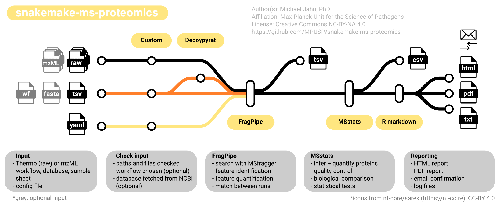

# snakemake-ms-proteomics

[](https://snakemake.github.io)
[](https://github.com/MPUSP/snakemake-ms-proteomics/actions/workflows/snakemake-tests.yml)


[](https://docs.conda.io/en/latest/)
[](https://snakemake.github.io/snakemake-workflow-catalog)

---

A Snakemake workflow for automatic processing and quality control of protein mass spectrometry data.

- [snakemake-ms-proteomics](#snakemake-ms-proteomics)
  - [Usage](#usage)
  - [workflow overview](#workflow-overview)
  - [Deployment options](#deployment-options)
  - [Authors](#authors)
  - [License](#license)
  - [References](#references)

## Usage

The usage of this workflow is described in the [Snakemake Workflow Catalog](https://snakemake.github.io/snakemake-workflow-catalog?wf=MPUSP/snakemake-ms-proteomics).

Detailed information about input data and workflow configuration can also be found in the [`config/README.md`](config/README.md).

If you use this workflow in a paper, don't forget to give credits to the authors by citing the URL of this repository or its DOI.

## workflow overview

<!-- include logo-->


---

This workflow is a best-practice workflow for the automated analysis of mass spectrometry proteomics data. It currently supports automated analysis of data-dependent acquisition (DDA) data with label-free quantification. An extension by different workflows (DIA, isotope labeling) is planned in the future.

The workflow is mainly a wrapper for the excellent tools [fragpipe](https://fragpipe.nesvilab.org/) and [MSstats](https://www.bioconductor.org/packages/release/bioc/html/MSstats.html), with additional modules that supply and check the required input files, and generate reports. The workflow is built using [snakemake](https://snakemake.readthedocs.io/en/stable/) and processes MS data using the following steps:

1. Prepare `workflow` file (`python` script)
2. Check user-supplied sample sheet (`python` script)
3. Check user-supplied database FASTA file (`python` script)
4. Generate decoy proteins ([DecoyPyrat](https://github.com/wtsi-proteomics/DecoyPYrat))
5. Import raw files, search protein database ([fragpipe](https://fragpipe.nesvilab.org/))
6. Align feature maps using IonQuant ([fragpipe](https://fragpipe.nesvilab.org/))
7. Import quantified features, infer and quantify proteins ([R MSstats](https://www.bioconductor.org/packages/release/bioc/html/MSstats.html))
8. Compare different biological conditions, export results ([R MSstats](https://www.bioconductor.org/packages/release/bioc/html/MSstats.html))
9. Generate HTML report with embedded QC plots ([R markdown](https://rmarkdown.rstudio.com/))
10. Generate PDF report from HTML [weasyprint](https://weasyprint.org/)
11. Send out report by email (`python` script)
12. Clean up temporary files after workflow execution (`bash` script)

If you want to contribute, report issues, or suggest features, please get in touch on [github](https://github.com/MPUSP/snakemake-ms-proteomics).

## Deployment options

To run the workflow from command line, change the working directory.

```bash
cd path/to/snakemake-workflow-name
```

Adjust options in the default config file `config/config.yml`.
Before running the complete workflow, you can perform a dry run using:

```bash
snakemake --dry-run
```

To run the workflow with test files using **conda**:

```bash
snakemake --cores 4 --sdm conda --directory .test
```

## Authors

- Dr. Michael Jahn
  - Affiliation: [Max-Planck-Unit for the Science of Pathogens](https://www.mpusp.mpg.de/) (MPUSP), Berlin, Germany
  - ORCID profile: https://orcid.org/0000-0002-3913-153X
  - github page: https://github.com/m-jahn

## License

- the contents of this repository are licensed with the [MIT License](https://choosealicense.com/licenses/mit/)
  - you are free use the workflow for your purposes free of charge
  - you are free to modify the contents and create derivative work
  - the only condition is that you refer to the original license and copyright owners (MPUSP)
  - all contents come with absolutely no warranty to work for your or any other purposes
  - all **third party dependencies are licensed under their own terms** and _not covered_ by this license

## References

- Essential tools are linked in the top section of this document
- The core of this workflow are the two external packages **fragpipe** and **MSstats**

**fragpipe**

1. Kong, A. T., Leprevost, F. V., Avtonomov, D. M., Mellacheruvu, D., & Nesvizhskii, A. I. (2017). _MSFragger: ultrafast and comprehensive peptide identification in mass spectrometry–based proteomics_. Nature Methods, 14(5), 513-520.
2. da Veiga Leprevost, F., Haynes, S. E., Avtonomov, D. M., Chang, H. Y., Shanmugam, A. K., Mellacheruvu, D., Kong, A. T., & Nesvizhskii, A. I. (2020). _Philosopher: a versatile toolkit for shotgun proteomics data analysis_. Nature Methods, 17(9), 869-870.
3. Yu, F., Haynes, S. E., & Nesvizhskii, A. I. (2021). _IonQuant enables accurate and sensitive label-free quantification with FDR-controlled match-between-runs_. Molecular & Cellular Proteomics, 20.

**MSstats**

1. Choi M (2014). _MSstats: an R package for statistical analysis of quantitative mass spectrometry-based proteomic experiments._ Bioinformatics, 30.
